<h1 align="center">
  <a></a>
  <br>
  AdvancedCLI
</h1>

<p align="center">
  <b>A modern command-line parsing library for Arduino with zero dynamic memory allocation.</b>
</p>

<p align="center">
  <a href="https://www.ardu-badge.com/AdvancedCLI">
    
  </a>
  <a href="https://registry.platformio.org/libraries/alkonosst/AdvancedCLI">
    
  </a>
  <br><br>
  <a href="https://opensource.org/licenses/MIT">
    
  </a>
  <br><br>
  <a href="https://ko-fi.com/alkonosst">
    
  </a>
</p>

---

# Table of contents <!-- omit in toc -->

- [Description](#description)
- [Key Features](#key-features)
- [Quick Example](#quick-example)
- [Installation](#installation)
  - [PlatformIO](#platformio)
  - [Arduino IDE](#arduino-ide)
- [Usage](#usage)
  - [Including the library](#including-the-library)
  - [Namespace](#namespace)
  - [Registering Commands](#registering-commands)
  - [Argument Types](#argument-types)
    - [Named Arguments](#named-arguments)
    - [Flags](#flags)
    - [Positional Arguments](#positional-arguments)
  - [Reading Parsed Values](#reading-parsed-values)
  - [Sub-commands](#sub-commands)
  - [Aliases](#aliases)
  - [Help System](#help-system)
  - [Error Handling](#error-handling)
  - [Validation And Invalid Callbacks](#validation-and-invalid-callbacks)
  - [Configuration Macros](#configuration-macros)
  - [Platform Notes](#platform-notes)
- [Release Status](#release-status)
- [License](#license)

---

# Description

**AdvancedCLI** is an Arduino library for defining commands, registering typed arguments, and dispatching parsed callbacks from any serial or stream input. Commands are registered once in `setup()` and then parsed on each incoming line in `loop()` - no manual token splitting required.

The library is designed for all architectures, from AVR (_some new boards with more RAM like Nano
Every_) to 32-bit (_ESP32, ESP8266, ARM Cortex-M, RP2040, etc._). All storage uses fixed-size,
statically allocated buffers; there is no dynamic memory allocation.

# Key Features

- **Zero dynamic allocation** - Fixed-size buffers throughout; no use of `new`, `malloc`, or `String`.
- **Typed arguments** - Named, positional, flag, integer, and float arguments with automatic type checking.
- **Custom output sink** - Attach any print function to route all CLI output (help, errors, etc.) to the desired destination.
- **Sub-commands** - Two-level hierarchical command structures (e.g. `wifi scan`, `wifi connect -ssid ...`).
- **Aliases** - Short names for any argument (e.g. `-v` as an alias for `-verbose`).
- **Validation callbacks** - Per-argument validators that accept or reject values before the command executes.
- **Help system** - `printHelp()` lists all registered commands, arguments, and descriptions.
- **Error routing** - Per-command `onError()` callbacks and per-argument `onInvalid()` callbacks.
- **Case-insensitive by default** - Command and argument matching is case-insensitive unless changed with `setCaseSensitive(true)`.

# Quick Example

```cpp
#include <Arduino.h>

#include <AdvancedCLI.h>
using namespace ACLI;

static AdvancedCLI cli; // Global instance of the CLI parser
static ArgStr name_arg; // Global handle for the "name" argument

void setup() {
  Serial.begin(115200);

  // Configure the output sink for help and error messages
  cli.setOutput([](const char* msg) { Serial.println(msg); });

  // Register a "hello" command with a named "name" argument and an execution callback
  Command& hello = cli.addCommand("hello").setDescription("Greets the provided name.");
  name_arg = hello.addArg("name", "World").setDescription("Name to greet.");

  hello.onExecute([](Command& cmd) {
    ParsedStr name = cmd.getArg(name_arg);
    Serial.print("Hello, ");
    Serial.print(name.getValue());
    Serial.println('!');
  });
}

void loop() {
  if (!Serial.available()) return;

  // Read a line of input from Serial into a buffer, then parse it.
  // For a terminal with "\r\n" line endings.
  static char buf[Config::MAX_INPUT_LEN];
  size_t len = Serial.readBytesUntil('\r', buf, sizeof(buf) - 1);
  buf[len]   = '\0';
  while (Serial.available()) Serial.read(); // flush remaining newline

  // Parse the input line; this will dispatch to the appropriate command callbacks.
  cli.parse(buf);
}
```

Sending `hello -name Arduino` over serial prints:

```
Hello, Arduino!
```

# Installation

## PlatformIO

Add to your `platformio.ini`:

```ini
[env:your_env]
; Most recent changes
lib_deps =
  https://github.com/alkonosst/AdvancedCLI.git

; Pinned release (recommended for production)
lib_deps =
  https://github.com/alkonosst/AdvancedCLI.git#vx.y.z
```

## Arduino IDE

1. Open Arduino IDE.
2. Go to **Sketch > Manage Libraries...**
3. Search for **"AdvancedCLI"**.
4. Click **Install**.

# Usage

## Including the library

A single header includes all public types:

```cpp
#include <AdvancedCLI.h>
```

## Namespace

All public types live in the `ACLI` namespace. Add `using namespace ACLI;` to avoid repeating the prefix:

```cpp
using namespace ACLI;

static AdvancedCLI cli;
static ArgStr name_arg;
static ArgInt count_arg;
static ArgFlag verbose_flag;
```

## Registering Commands

Call `addCommand()` during `setup()` and chain builder methods to configure the command. The resulting `Command&` reference is used to attach arguments and a callback:

```cpp
Command& cmd = cli.addCommand("ping");
cmd.setDescription("Replies with pong.");
cmd.onExecute([](Command&) { Serial.println("pong"); });
```

Builder methods can also be chained directly on the return value:

```cpp
cli.addCommand("ping")
  .setDescription("Replies with pong.")
  .onExecute([](Command&) { Serial.println("pong"); });
```

## Argument Types

Each `add*()` method returns a typed **handle** (`ArgStr`, `ArgInt`, etc.). Store it as a global variable and pass it to `cmd.getArg(handle)` inside the callback to retrieve the parsed value.

| Type               | Registration method      | Input syntax  | Handle / Reader            |
| ------------------ | ------------------------ | ------------- | -------------------------- |
| Named string       | `addArg("name")`         | `-name value` | `ArgStr` / `ParsedStr`     |
| Named integer      | `addIntArg("name")`      | `-name 42`    | `ArgInt` / `ParsedInt`     |
| Named float        | `addFloatArg("name")`    | `-name 3.14`  | `ArgFloat` / `ParsedFloat` |
| Flag               | `addFlag("name")`        | `-name`       | `ArgFlag` / `ParsedFlag`   |
| Positional string  | `addPosArg("name")`      | `value`       | `ArgStr` / `ParsedStr`     |
| Positional integer | `addPosIntArg("name")`   | `42`          | `ArgInt` / `ParsedInt`     |
| Positional float   | `addPosFloatArg("name")` | `3.14`        | `ArgFloat` / `ParsedFloat` |

> [!IMPORTANT]
> Argument handles must be stored as **global** (or static) variables. They must remain valid for the entire lifetime of the `AdvancedCLI` instance.

### Named Arguments

Named arguments are matched by their `-name` prefix. An optional default value makes the argument optional:

```cpp
static ArgStr msg_arg;

Command& echo_cmd = cli.addCommand("echo");
// Required - omitting -msg causes a parse error
msg_arg = echo_cmd.addArg("msg").setDescription("Text to print.").setRequired();
echo_cmd.onExecute([](Command& cmd) {
  ParsedStr msg = cmd.getArg(msg_arg);
  Serial.println(msg.getValue());
});
```

With a default value:

```cpp
msg_arg = echo_cmd.addArg("msg", "hello"); // defaults to "hello" when -msg is absent
```

Integer and float variants work identically, with typed defaults:

```cpp
static ArgInt pin_arg;
static ArgFloat gain_arg;

pin_arg  = cmd.addIntArg("pin", 13);
gain_arg = cmd.addFloatArg("gain", 1.0f);
```

### Flags

Flags are boolean arguments: present in the input means `true`, absent means `false`. They accept no value token.

```cpp
static ArgFlag verbose_flag;

Command& status_cmd = cli.addCommand("status");
verbose_flag = status_cmd.addFlag("verbose").setAlias("v");
status_cmd.onExecute([](Command& cmd) {
  ParsedFlag verbose = cmd.getArg(verbose_flag);
  if (verbose.isSet()) Serial.println("Verbose mode.");
});
```

Sending `status` prints nothing. Sending `status -verbose` or `status -v` prints `Verbose mode.`

### Positional Arguments

Positional arguments are matched by their position in the input, not by a name prefix. They do not require a dash.

```cpp
static ArgInt add_a;
static ArgInt add_b;

Command& add_cmd = cli.addCommand("add");
add_a = add_cmd.addPosIntArg("a").setRequired();
add_b = add_cmd.addPosIntArg("b").setRequired();
add_cmd.onExecute([](Command& cmd) {
  ParsedInt a = cmd.getArg(add_a);
  ParsedInt b = cmd.getArg(add_b);
  Serial.println(a.getValue() + b.getValue());
});
```

Sending `add 3 -5` prints `-2`. Negative numbers (e.g. `-5`) are correctly distinguished from argument names.

> [!NOTE]
> Use `--` to force all subsequent tokens to be treated as positional values, even if they start with `-`. For example: `cmd -- -this-is-a-value`.

## Reading Parsed Values

Inside the execution callback, call `cmd.getArg(handle)` to retrieve a typed reader object:

| Reader type   | `getValue()` return type | `isSet()` meaning                      |
| ------------- | ------------------------ | -------------------------------------- |
| `ParsedStr`   | `const char*`            | Argument was provided or has a default |
| `ParsedInt`   | `int32_t`                | Argument was provided or has a default |
| `ParsedFloat` | `float`                  | Argument was provided or has a default |
| `ParsedFlag`  | Not available            | Flag was present in the input          |
| `ParsedAny`   | `const char*`            | Argument was provided or has a default |

All reader types also provide `isValid()`, which returns `false` if the handle does not belong to the current command.

To retrieve an argument by name without a stored handle, use `getArgByName()`:

```cpp
ParsedAny field = cmd.getArgByName("field");
if (field.isSet()) Serial.println(field.getValue());
```

## Sub-commands

Sub-commands create a two-level command hierarchy. The parser dispatches `wifi scan` to the `scan` sub-command of `wifi`:

```cpp
Command& wifi = cli.addCommand("wifi");
wifi.setDescription("Wi-Fi management commands.");

wifi.addSubCommand("scan")
  .setDescription("Scans for nearby networks.")
  .onExecute([](Command&) { Serial.println("Scanning..."); });

static ArgStr connect_ssid;
Command& connect_cmd = wifi.addSubCommand("connect");
connect_ssid = connect_cmd.addArg("ssid").setRequired();
connect_cmd.onExecute([](Command& cmd) {
  ParsedStr ssid = cmd.getArg(connect_ssid);
  Serial.print("Connecting to: ");
  Serial.println(ssid.getValue());
});
```

Sub-commands have their own independent argument sets and are listed under their parent in `printHelp()`.

## Aliases

Any argument can have one or more aliases. Aliases are searched alongside the primary name:

```cpp
static ArgFlag verbose_flag;

verbose_flag = cmd.addFlag("verbose").setAlias("v");
// Both "-verbose" and "-v" activate this flag.
```

Multiple aliases can be chained:

```cpp
my_arg.setAlias("v").setAlias("verb");
```

## Help System

Attach an output sink, then call `printHelp()` at any time:

```cpp
cli.setOutput([](const char* msg) { Serial.println(msg); });

cli.printHelp();          // Print all commands
cli.printHelp("wifi");    // Print help for a single command (and its sub-commands)
```

A standard `help` command implementation using an optional positional target:

```cpp
static ArgStr help_target;

Command& help_cmd = cli.addCommand("help");
help_cmd.setDescription("Prints available commands.");
help_target = help_cmd.addPosArg("command").setDescription("Command name (optional).");
help_cmd.onExecute([](Command& cmd) {
  ParsedStr target = cmd.getArg(help_target);
  if (target.isSet()) {
    cli.printHelp(target.getValue());
  } else {
    cli.printHelp();
  }
});
```

Sample output of `help`:

```
Available commands:
  servo            Sets the servo angle.
    -angle         [named] Angle in degrees. *required*
  help             Prints available commands.
    -command       [pos  ] Command name (optional).
```

## Error Handling

**Command-level error handler (`onError`):** replaces the default CLI error output for a specific command. It is called for both parse errors (missing required argument, wrong type) and explicit `fail()` calls:

```cpp
reboot_cmd.onError([](Command&, const char* err) {
  Serial.print("[Reboot] Error: ");
  Serial.println(err);
});
```

**Runtime failure (`fail`):** signals a runtime error from inside the execution callback. It sets the parse result to failed and routes through `onError()`:

```cpp
reboot_cmd.onExecute([](Command& cmd) {
  ParsedInt delay_arg = cmd.getArg(reboot_delay);
  if (delay_arg.getValue() > 10000) {
    cmd.fail("Delay must be <= 10000 ms.");
    return;
  }
  // ... proceed normally
});
```

**Unknown command handler:** replaces the default `[CLI] Unknown command: ...` message:

```cpp
cli.onUnknownCommand([](const char* name) {
  Serial.print("Unknown command: ");
  Serial.println(name);
});
```

**`parse()` return value:** `cli.parse()` returns `false` if any error occurred during parsing or execution. The same value is accessible afterwards via `cli.lastParseOk()`:

```cpp
bool ok = cli.parse(buf);
if (!ok) Serial.println("Parse failed.");
```

## Validation And Invalid Callbacks

> [!IMPORTANT]
> Validation callbacks require `ACLI_ENABLE_VALIDATION_FN=1` in your build flags. This is enabled by default on 32-bit platforms (ESP32, ARM, RP2040). It is disabled by default on AVR to conserve RAM.

Call `setValidator()` on any typed argument to supply a predicate. The parser rejects the value and fires an error if the predicate returns `false`:

```cpp
static ArgInt servo_angle;

servo_angle = servo_cmd.addIntArg("angle")
  .setRequired()
  .setValidator([](const int32_t v) { return v >= 0 && v <= 180; });
```

> [!NOTE]
> `onInvalid()` requires `ACLI_ENABLE_INVALID_FN=1`, also enabled by default on 32-bit platforms.

To customise the error message for a rejected value, chain `onInvalid()`:

```cpp
servo_angle = servo_cmd.addIntArg("angle")
  .setRequired()
  .setValidator([](const int32_t v) { return v >= 0 && v <= 180; })
  .onInvalid([](const char* arg_name, const char* value, const char*) {
    Serial.print("Angle \"");
    Serial.print(value);
    Serial.println("\" is outside [0, 180].");
  });
```

## Configuration Macros

All capacity limits are compile-time constants that can be overridden via `build_flags` in `platformio.ini`, or via `#define` before including the header.

| Macro                       | AVR default | 32-bit default | Description                                                     |
| --------------------------- | ----------- | -------------- | --------------------------------------------------------------- |
| `ACLI_MAX_COMMANDS`         | 4           | 16             | Maximum number of registered commands (including sub-commands). |
| `ACLI_MAX_ARGS_PER_CMD`     | 4           | 8              | Maximum arguments per command.                                  |
| `ACLI_MAX_NAME_LEN`         | 8           | 24             | Maximum length of a command or argument name (characters).      |
| `ACLI_MAX_VALUE_LEN`        | 32          | 64             | Maximum length of a parsed argument value (characters).         |
| `ACLI_MAX_DESC_LEN`         | 16          | 64             | Maximum description string length stored inline.                |
| `ACLI_MAX_INPUT_LEN`        | 64          | 256            | Maximum parseable input line length (characters).               |
| `ACLI_MAX_ALIASES`          | 1           | 4              | Maximum aliases per argument.                                   |
| `ACLI_ENABLE_VALIDATION_FN` | 0           | 1              | Enable `setValidator()` support.                                |
| `ACLI_ENABLE_INVALID_FN`    | 0           | 1              | Enable `onInvalid()` support.                                   |

Example override in `platformio.ini`:

```ini
[env:my_board]
build_flags =
  -D ACLI_MAX_COMMANDS=32
  -D ACLI_MAX_ARGS_PER_CMD=12
  -D ACLI_ENABLE_VALIDATION_FN=1
```

## Platform Notes

| Feature           | AVR                                                 | 32-bit (ESP32, ARM, RP2040...)              |
| ----------------- | --------------------------------------------------- | ------------------------------------------- |
| Callbacks         | Plain function pointers (`ACLI_USE_STD_FUNCTION=0`) | `std::function` (`ACLI_USE_STD_FUNCTION=1`) |
| Capturing lambdas | Not supported                                       | Supported                                   |
| Validation        | Disabled by default                                 | Enabled by default                          |
| Capacity          | Conservative (less RAM)                             | Generous                                    |

> [!NOTE]
> On AVR, lambdas **with captures** (e.g. `[&]`, `[=]`) cannot be used as callbacks because `std::function` is unavailable. Use plain non-capturing lambdas, which decay to function pointers, or named free functions.

> [!WARNING]
> On AVR, `ACLI_ENABLE_VALIDATION_FN` and `ACLI_ENABLE_INVALID_FN` default to `0`. Enabling them on
> boards with very limited RAM (e.g. ATMega4809 with 6 kB) may cause instability. Measure free heap
> before enabling on AVR.

# Release Status

This project is in active development. Until reaching version **v1.0.0**, consider it **beta software**. APIs may change in future releases, and some features may be incomplete or unstable. Please report any issues on the [GitHub Issues](https://github.com/alkonosst/AdvancedCLI/issues) page.

# License

This project is licensed under the MIT License - see the [LICENSE](LICENSE) file for details.
